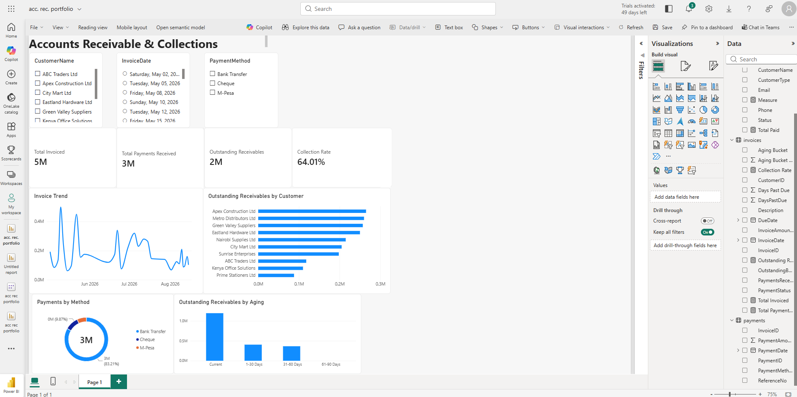

# Accounts Receivable & Collections Dashboard | Power BI

A one-page Power BI dashboard for monitoring invoicing, received payments, outstanding receivables, collection rate, customer exposure, payment-method mix, and aging.

> **Portfolio note:** This repository contains the Power BI Project (`.pbip`) source files and documentation only. Customer-level source data is intentionally excluded.

## Dashboard preview



## Business questions answered

- How much is currently outstanding and how much is overdue?
- Which customers and invoices create the largest collection risk?
- How is the receivables balance distributed across aging buckets?
- Are collection trends improving over time?
- Which owners, regions, or customer segments need attention?

## Report layout

The report has one page, **Accounts Receivable & Collections**, arranged as follows:

1. **Slicers:** CustomerName, InvoiceDate, and PaymentMethod.
2. **KPI cards:** Total Invoiced, Total Payments Received, Outstanding Receivables, and Collection Rate.
3. **Analysis visuals:** Invoice Trend; Outstanding Receivables by Customer; Payments by Method; Outstanding Receivables by Aging.

## Core KPIs

| KPI | Definition |
| --- | --- |
| Total receivables | Sum of open invoice balances. |
| Overdue receivables | Open balance for invoices past their due date. |
| Overdue rate | Overdue receivables divided by total receivables. |
| Total payments received | Sum of payments received for the selected filters. |
| Collection rate | Total payments received divided by total invoiced. |

## Dashboard pages

1. **Accounts Receivable & Collections** — the complete executive view shown above.

## Repository structure

```text
Accounts-Receivable-Dashboard/
├── Accounts-Receivable-Dashboard.pbip     # Add after saving from Power BI Desktop
├── Accounts-Receivable-Dashboard.Report/  # Generated by Power BI Desktop
├── Accounts-Receivable-Dashboard.SemanticModel/
├── docs/
│   ├── dashboard-setup.md              # Save/publish workflow
│   ├── rebuild-dashboard.md            # Exact report build guide + DAX
│   ├── data-dictionary.md
│   └── images/accounts-receivable-dashboard.png
├── .gitignore
├── LICENSE
└── README.md
```

## Tools

- Power BI Desktop (current release)
- Git and a GitHub account

## Use this project locally

1. Clone the repository.
2. Open `Accounts-Receivable-Dashboard.pbip` in Power BI Desktop.
3. Update the data-source parameters to point to your local, anonymised sample data or approved source.
4. Refresh the model and validate the KPI totals.

Use [the exact build guide](docs/rebuild-dashboard.md) to recreate the report, then follow [the publishing guide](docs/dashboard-setup.md) to save and publish it.

## Data privacy

Do not publish real customer names, invoice numbers, payment details, credentials, or confidential financial data. Use anonymised data for screenshots and demonstrations, and keep production connection details in Power BI parameters or your organisation's approved secret-management process.

## Author

Your Name — Power BI / Data Analytics Portfolio
